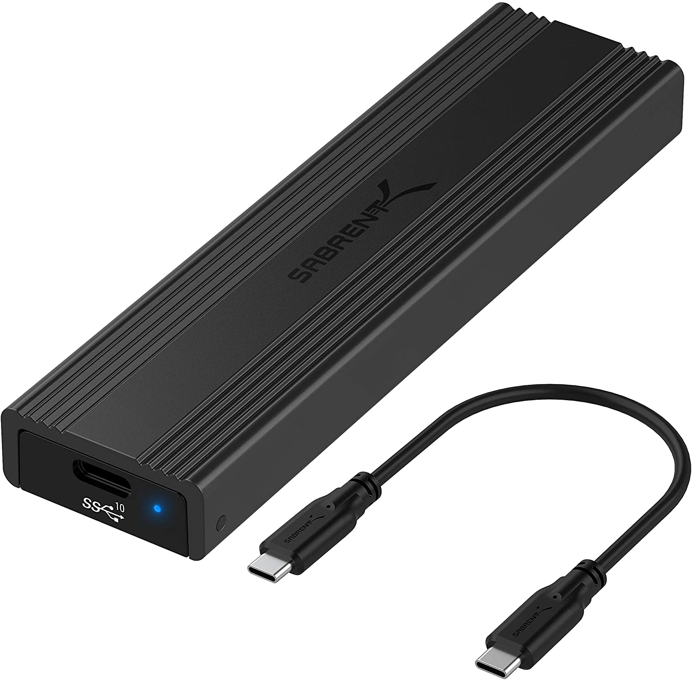

I seem to be constantly shorting my SATA SSD hard drives.  There is a graveyard of hard drives.  The cheapest SSDs one can buy. 

Apparently you must be selective about which SATA cable your power supply uses.  It turns out they are not the same.  They are supposed to be.  For the record, shorted SSDs smells like burnt plastic.

My solution to this problem?  Don't buy SATA hard drives.  Buy M.2 SSDs.  Ta-da!  In order to reimage them, I bought [Sabrent USB 3.2 Type-C Tool-Free Enclosure for M.2 PCIe NVMe and SATA SSD](https://www.amazon.com/dp/product/B08RVC6F9Y/).

* CONVENIENCE: 100% Tool-Free, quickly install and remove SSDs without any tools.
* DESIGN: Ultra-slim Aluminum case with ABS frame. Sleek, Durable, and Convenient. Portable yet durable, ideal for traveling.
* COMPATIBILITY: M.2 form factor compatible with both SATA and NVME in sizes: 2242/2260/2280.
* SPEED: USB 3.2 supports data transmission speeds of up to 10Gbps for steady and efficient data transfer. Backward compatible with USB 3.1 and USB 3.0 at respective speed limits.
* PLUG & PLAY: No additional drivers required. Bus powered. Does not need an external power supply. Perfect for tech nerds, 4K content designers, and engineers. At up to 1000MB/s, Data copy and transferring will be done in in no time.

Featured product: [Sabrent USB 3.2 Type-C Tool-Free Enclosure for M.2 PCIe NVMe and SATA SSD](https://www.amazon.com/dp/B08RVC6F9Y/)

A cheap M.2 SSD: [Kingston A400 120G Internal SSD M.2 2280 SA400M8/120G](https://www.amazon.com/dp/B07P22T3VD/)

