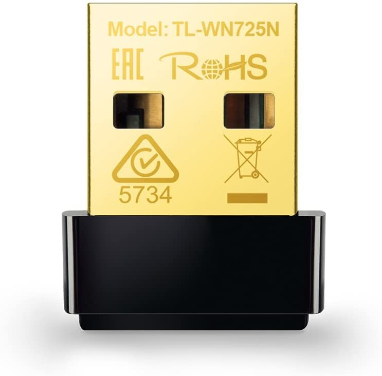

Nothing says noob faster than using Windows and mining with NiceHash.  It is pumpkin spice latte of the crypocurrency mining world. 

Anyone not mining with their gaming PC should use a linux-based OS, like my favorite HiveOS.  

Why?  

Only a thousand reasons, but let's a few for argument sake.

* Startup Time - When is the last time you installed Windows?  How many hours of updates did you have to endure?  With HiveOS, I can flash my hard drive, plug it back into the computer, and configure it faster than Windows can install.  15 minutes.  
* Stability
* Less resources
* Easier to control

It's *FREE* for the first four rigs.  What are you waiting for?

Featured product: [TP-Link USB WiFi Adapter](https://www.amazon.com/dp/B008IFXQFU/)

